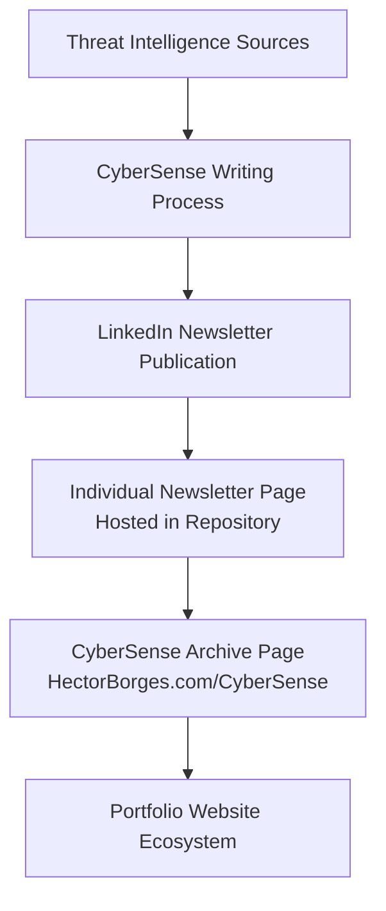

![CyberSense Banner] (assets/CyberSense.png)

# Cybersecurity Portfolio – Hector Borges
A cybersecurity portfolio and publishing platform designed to present research, professional credentials, and the CyberSense Daily Digital Awareness Brief.

This repository hosts the static infrastructure behind HectorBorges.com, which serves as a centralized hub for cybersecurity research, professional documentation, and security awareness publications.

The platform integrates a portfolio website with a cybersecurity intelligence newsletter to promote structured understanding of the evolving digital threat landscape.

[](https://www.hectorborges.com)
[](https://www.hectorborges.com/cybersense)
[](https://www.linkedin.com)
[](SECURITY.md)

# 📡 CyberSense – Daily Digital Awareness Brief 🛰️

CyberSense is a recurring cybersecurity intelligence briefing that analyzes emerging threats, defensive practices, and technology developments affecting the modern digital ecosystem.

Each issue translates complex cybersecurity reporting into structured situational awareness, allowing readers to understand not only what happened, but why it matters and how to respond.

The briefing aims to cultivate disciplined digital intuition across the workforce, developing awareness one byte of sense at a time.

# Publishing Architecture

The CyberSense newsletter operates through a hybrid distribution model that integrates LinkedIn publishing with a self-hosted archive.



## This architecture ensures:

• primary audience reach through LinkedIn

• permanent ownership of newsletter content

• centralized archival access through the portfolio site


# 📰 CyberSense Brief Structure 🗞️

Each briefing follows a standardized intelligence framework.

## Opening Notes

Introduces the strategic theme of the issue and establishes context for the cybersecurity developments discussed.

## Situational Awareness

The primary intelligence section analyzing developments such as:

* malware campaigns

* cybercrime economies

* threat actor tactics

* security research findings

* emerging vulnerabilities

## Training Byte

A short operational lesson focused on defensive awareness.

Each training byte explains:

* vulnerability mechanism

* attack vector

* mitigation strategy

## Career Development

Curated cybersecurity learning resources including courses, frameworks, certifications, and research tools.

## Modernization and AI Insight

Analysis of emerging technologies influencing cybersecurity strategy, including artificial intelligence, governance frameworks, and security innovation.

# Repository Structure

hectorborges-portfolio
```text
├── assets/
│   ├── favicon/
│   ├── images/
│   └── logos/
│
├── newsletter/
│   ├── 01012026.html
│   ├── 01022026.html
│   └── ...
│
├── index.html
├── cybersense.html
├── research.html
├── documents.html
├── about.html
├── resume.html
├── contact.html
│
├── README.md
├── SECURITY.md
└── .gitignore
```
The newsletter directory contains archived CyberSense briefings, each stored as a standalone HTML page to ensure persistent access and direct linking from LinkedIn.

# Website Sections
## Home

Introduces the portfolio and provides navigation to professional materials.

## CyberSense

Hosts the CyberSense Digital Awareness Brief and the full newsletter archive.

Visitors can:

* read the latest briefing

* browse archived issues

* subscribe through LinkedIn

## Research

Hyperlinks to my technical cybersecurity writing and analytical work.

## Documents (Not Yet Published)

Academic papers, professional reports, and reference materials, checklists, presentations.

## Resume

Professional background and experience.

## Contact

Professional communication channel.

# ⚙️ CyberSense Production Workflow

The newsletter follows a disciplined intelligence cycle.

1. Monitor cybersecurity developments across threat intelligence reporting and security research.

2. Evaluate technical implications and operational risks.

3. Synthesize findings into structured analytical narratives.

4. Publish the briefing through LinkedIn.

5. Archive the briefing within the portfolio repository.

# 🛡️ Security Considerations

This repository contains only static website content and publicly available research material.

Sensitive data, authentication tokens, or private research datasets are not stored within this project.

The repository is maintained strictly as a public information platform.

# 👤 Author

Hector Borges
Cybersecurity Graduate Student
Military Operations Planning Background

CyberSense reflects an ongoing effort to strengthen digital awareness by translating complex cybersecurity developments into practical operational understanding.

Portfolio Website
https://www.HectorBorges.com
